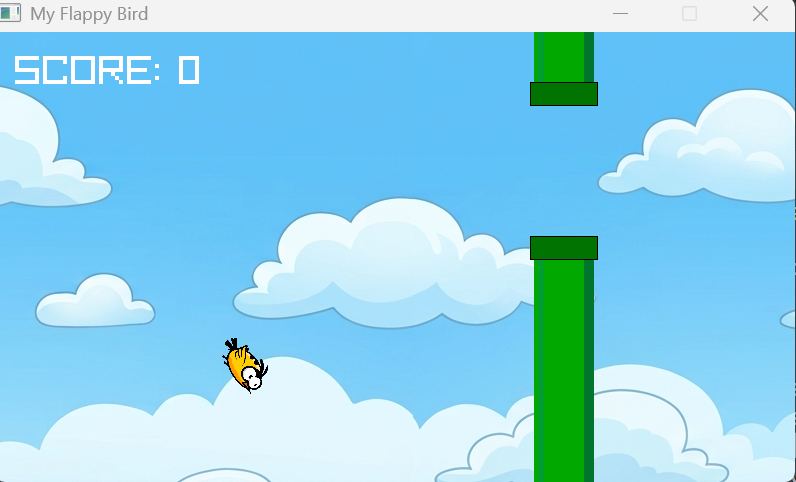
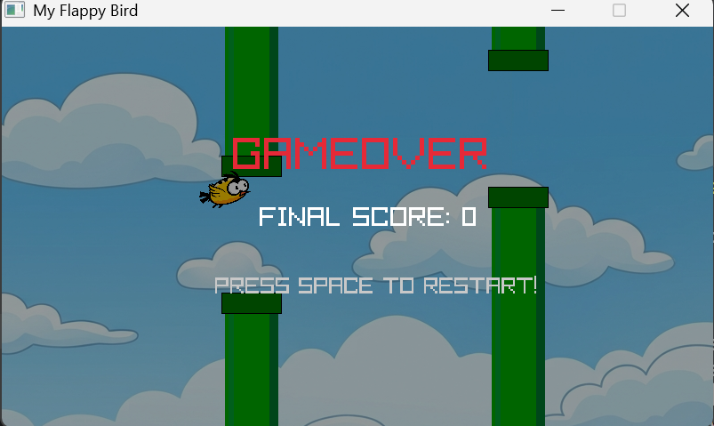

# Flappy Bird (C++ & Raylib)

A Flappy Bird clone built using **C++** and the **Raylib** graphics library.

## Features

- Smooth bird movement
- Infinite scrolling background
- Randomly generated pipes
- Score counter
- Collision detection
- Sound effects
- Game over and restart system

## Screenshots

### Gameplay



### Game Over



## Controls

| Key | Action |
|-----|--------|
| Space | Jump |
| Space (after Game Over) | Restart |

## Technologies Used

- C++
- Raylib
- Visual Studio Code
- Git & GitHub

## Project Structure

```
Flappy-Bird-Raylib/
│
├── assets/
│   ├── bg.png
│   ├── bird.png
│   ├── Jump.wav
│   └── Blip.wav
│
├── images/
│   ├── gameplay.png
│   └── gameover.png
│
├── src/
│   └── main.cpp
│
└── README.md
```

## How to Build

1. Install Raylib.
2. Clone this repository:

```bash
git clone https://github.com/Urba1502/Flappy-Bird-Raylib.git
```

3. Open the project in Visual Studio Code.

4. Compile using g++:

```bash
g++ src/main.cpp -o game.exe ^
-I C:\raylib\raylib\src ^
-L C:\raylib\raylib\src ^
-lraylib -lopengl32 -lgdi32 -lwinmm
```

5. Run:

```bash
game.exe
```

## Author

**Urba1502**